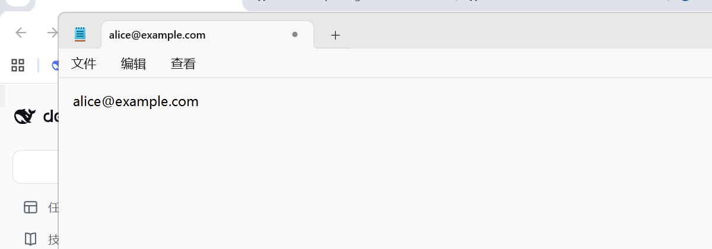
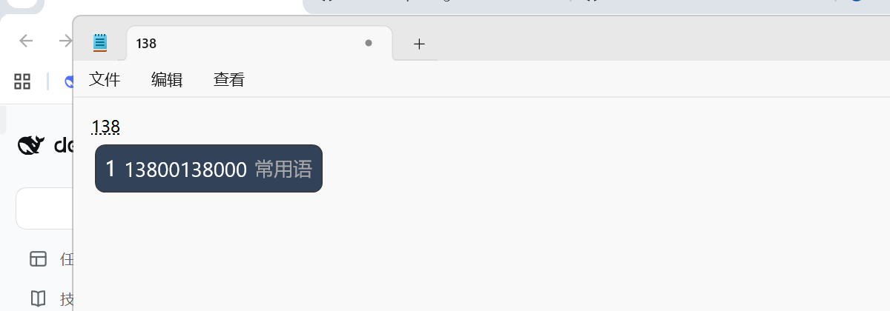
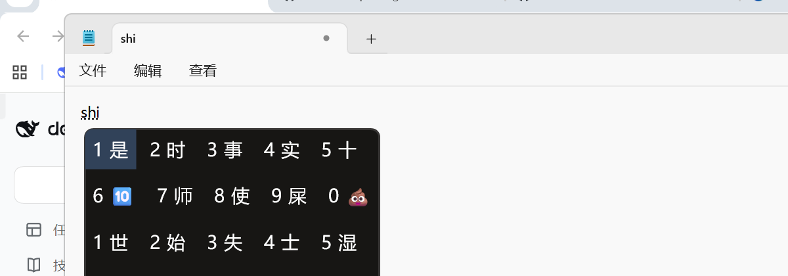
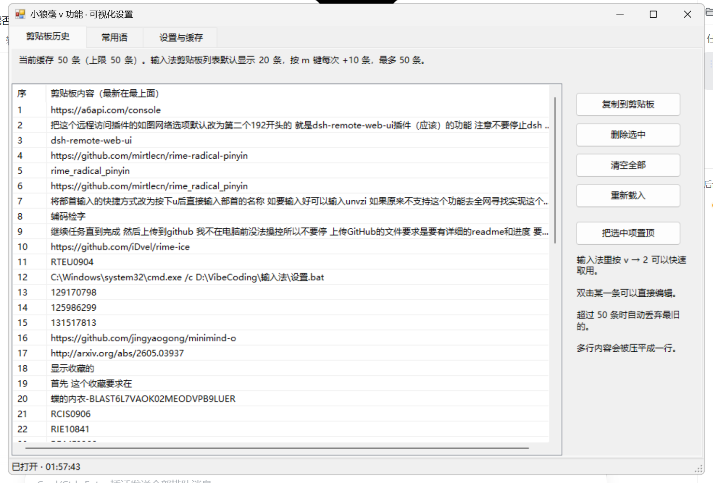
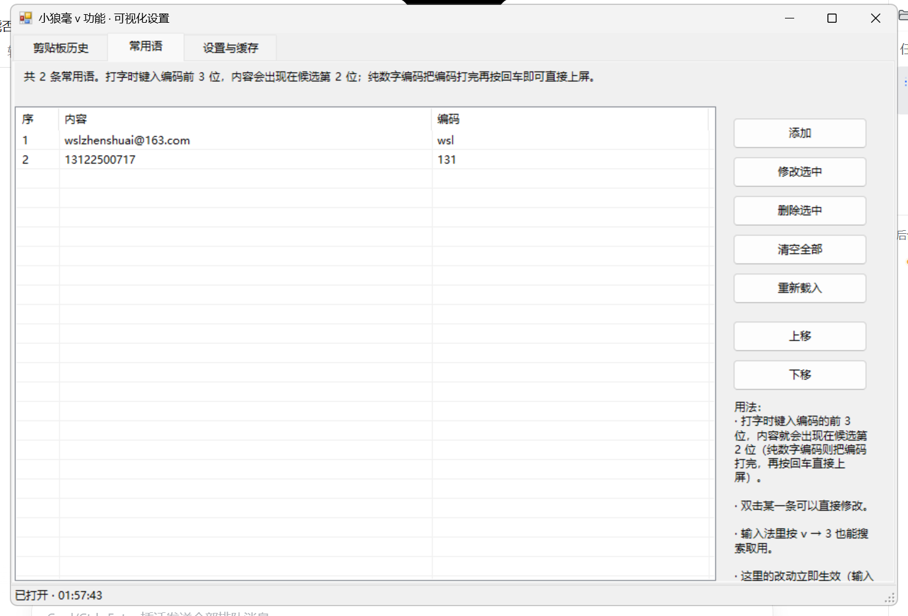
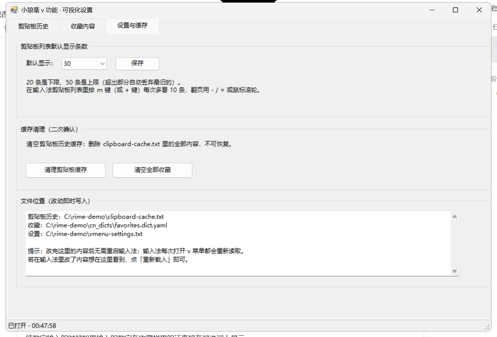
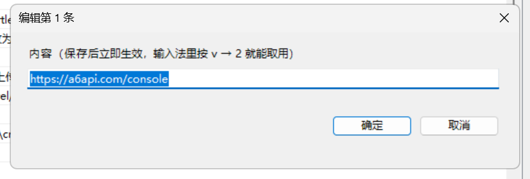
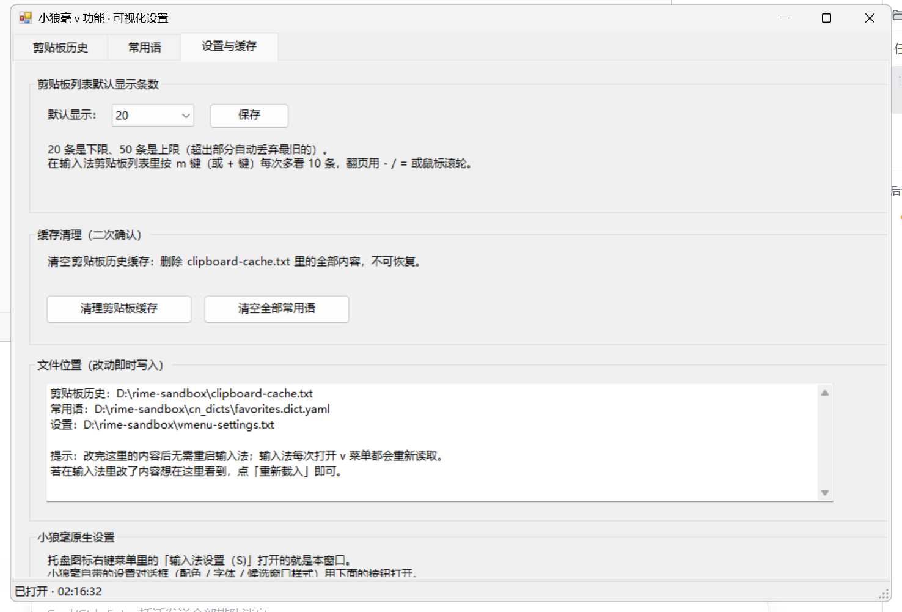

# weasel-vmenu · 小狼毫输入法「v 功能菜单」

给小狼毫（Weasel / librime）加一套 **v 功能菜单**：可视化设置窗口、剪贴板历史、常用语快捷输入、
多行候选框，以及「原符号输入」还原。全部用 **librime-lua + PowerShell 5.1** 实现，
不改输入法源码、不重新编译。

> **English TL;DR** — A Lua + PowerShell extension pack for the
> [Weasel](https://github.com/rime/weasel) IME on Windows (built and verified against
> Weasel 0.17.4 + librime 1.13.1 + [rime-ice](https://github.com/iDvel/rime-ice)):
> press `v` for a menu (`1` 设置 / `2` 剪贴板 / `3` 常用语 / `4` 原符号).
> Includes a **resident WinForms settings GUI** that opens in ~0.1 s, a clipboard-history
> quick picker, favourite snippets that appear as **candidate #2 while you type their code**
> (Enter invokes them), a **multi-row candidate window** (theme `max_width` + schema `page_size`),
> and the isolation/tooling to verify everything with screenshots.
> Source in `src/`, verification harness in `tools/`, docs in `docs/`.
> See [`docs/AGENT-HANDOFF.md`](docs/AGENT-HANDOFF.md) before changing anything.

---

## 1. 它是什么

按 `v` 打开功能菜单（候选栏里只有 4 个短词）：

| 候选 | 功能 | 说明 |
| --- | --- | --- |
| `1 设置` | 可视化设置窗口 | 常驻进程，`v`→`1` 后约 **0.1 秒**出现窗口 |
| `2 剪贴板` | 剪贴板快查 | 后台脚本同步系统剪贴板到文本文件，Lua 只读文件 |
| `3 常用语` | 常用语快查 | 可继续输入编码过滤（注释显示「快捷内容」） |
| `4 原符号` | 还原原版 `v` 模式 | 之后直接输入符号编码（`2` → 二 贰 ² ₂ Ⅱ …） |

> 原来的第 5 项「文字设置」（`vset` 纯键盘设置）已从菜单**去掉**：`vset` / `vsetc` / `vsetf` /
> `vsetn` / `vsetx` 的 Lua 代码**保留但不再能从菜单进入**，只有手打 `vset` 才进得去。
> 设置一律走第 1 项的可视化窗口。

除菜单外还有四条「不用按 v」的能力：

* **常用语候选第 2 位**：正常打字时键入常用语编码的**前 3 位**，内容直接出现在候选第 2 位
  （注释显示「常用语」）。
* **编码打完 + 回车 = 直接调用**：输入与某条编码**完全一致**时，回车把内容上屏
  （字母编码、纯数字编码都支持）。
* **多行候选框**：候选多了会自动换行排成多栏（见 §4「多行候选框」）。
* **托盘图标右键菜单里的「输入法设置 (S)」**：右键任务栏托盘的小狼毫图标，菜单第一项就是它，
  点开的是同一个 vmenu 可视化设置窗口（原来这一项叫「输入法设定 (S)」，打开的是小狼毫自带对话框）。
  做法是**改一句菜单文字 + 用一个代理顶替 `WeaselDeployer.exe`**，可一键撤销；
  重新部署 / 用户词典管理 / 用户资料同步三项行为完全不变（机制与安装见 §3.4）。
  小狼毫自带的设置对话框（配色 / 字体等）改从设置窗口的「小狼毫原生设置」分组打开。

> **关于「收藏 → 常用语」改名**：本次只改**用户可见文本**（菜单项、列表标题/空态/搜索提示、
> 候选注释、设置窗口标签页与按钮文案）。内部命名与文件格式**沿用旧名**——
> `favorites.dict.yaml`、候选 `type` 前缀 `vfav`、`vset*` 模式、`vmenu-settings.txt` 都没变，
> 以免破坏已有数据与配置。

## 2. 界面

### 输入法候选栏

| 截图 | 说明 |
| --- | --- |
|  | 按 `v`：4 个短候选（设置 / 剪贴板 / 常用语 / 原符号） |
|  | 打字时输入编码前 3 位 `you`，候选第 2 位就是常用语内容 `alice@example.com`（注释「常用语」） |
|  | 编码打完按回车，内容直接上屏 |
|  | **纯数字编码**：输入 `138` → 候选直接显示 `13800138000`，回车调用 |
|  | `v`→`3` 常用语快查列表 |
|  | **多行候选框**：一页 18 条候选按 `max_width` 自动换行，排成约 4 行 × 5 列 |

### 可视化设置窗口（三个标签页）

| 截图 | 说明 |
| --- | --- |
|  | 剪贴板历史：复制到剪贴板 / 删除选中 / 清空全部（二次确认）/ 重新载入 / 置顶；双击某条 = **弹出「编辑第 N 条」直接改内容** |
|  | 常用语：添加 / 修改 / 删除 / 清空（二次确认）/ 上移 / 下移；改动**立即**对输入法生效；双击某条 = 直接「修改常用语」 |
|  | 设置与缓存：列表默认条数（20–50）、缓存清理、文件位置一览 |
|  | 双击剪贴板某一行后弹出的「编辑第 N 条」编辑框（打开时原文已全选） |
|  | 「设置与缓存」页底部的**小狼毫原生设置**分组与「打开小狼毫原生设置」按钮（点它会弹出小狼毫自带的 `【小狼毫】方案选单设定` 对话框：配色 / 字体 / 候选窗口样式） |

> README 里的截图全部使用**示例数据**（`alice@example.com`、`13800138000` 等），
> 不包含任何真实剪贴板或常用语内容。

## 3. 安装

### 3.1 依赖

| 组件 | 版本（本仓库验证过的） |
| --- | --- |
| [Weasel 小狼毫](https://github.com/rime/weasel) | 0.17.4（librime 1.13.1） |
| 方案 | [rime-ice 雾凇拼音](https://github.com/iDvel/rime-ice)（`rime_ice` schema，带 `lua/` 目录） |
| PowerShell | Windows PowerShell 5.1（不需要 PowerShell 7） |

### 3.2 部署 Lua 侧

1. 把 `src/lua/*.lua` 复制到 **Rime 用户目录**的 `lua/` 下：

   ```
   <RimeUserDir>\lua\vmenu_core.lua
   <RimeUserDir>\lua\menu_processor.lua
   <RimeUserDir>\lua\menu_filter.lua
   <RimeUserDir>\lua\lua_menu.lua
   ```

   `<RimeUserDir>` 可以用注册表读到（本机是 `D:\rime-sandbox`）：

   ```powershell
   (Get-ItemProperty 'HKCU:\Software\Rime\Weasel').RimeUserDir
   ```

2. 在方案里注册 Lua 组件。**这一步必须落到编译后的 `build\rime_ice.schema.yaml`**：
   Weasel 的部署器只从 `*.custom.yaml` 读取 `engine/processors|translators|filters`、
   `punctuator/symbols`、`recognizer/patterns` 这些**结构性**配置，而且当
   librime 的 `DetectModifications` 判定「无改动」时会**直接中止整个部署**。
   本仓库的 `src/windows/patch-build-schema.ps1` 就是把这几个键的语义直接写回
   `build/rime_ice.schema.yaml`，再重启服务（可重复运行）：

   ```powershell
   powershell -NoProfile -ExecutionPolicy Bypass -File .\patch-build-schema.ps1 -RimeDir "D:\rime-sandbox"
   ```

   需要写入的关键片段（详见 `docs/ARCHITECTURE.md`）：

   ```yaml
   engine:
     processors:
       - lua_processor@*menu_processor   # 必须排在 speller / selector 之前
     translators:
       - lua_translator@*lua_menu        # 生成 v 菜单 / 剪贴板 / 收藏 / 设置的行
     filters:
       - lua_filter@*menu_filter         # v 模式过滤 + 收藏插到候选第 2 位
   ```

3. 重启 `WeaselServer.exe`（Lua 是运行时加载的，改完必须重启服务才生效）：

   ```powershell
   Get-Process WeaselServer | Stop-Process -Force
   Start-Process 'C:\Program Files\Rime\weasel-0.17.4\WeaselServer.exe'
   ```

### 3.3 部署 Windows 侧（后台服务 + 设置窗口）

把 `src/windows/` 整个目录放到任意位置（脚本用 `%~dp0` / 同目录互相调用），然后：

```powershell
# 双击即可：先停掉旧实例，再启动两个服务，并顺手打开设置窗口
.\clipboard-sync.bat
```

它会启动：

| 脚本 | 作用 |
| --- | --- |
| `clipboard-sync.ps1` | 每 1 秒把系统剪贴板同步进 `<RimeUserDir>\clipboard-cache.txt`（去重、上限 50、新的在前） |
| `vmenu-watcher.ps1` | 守护**常驻**的设置窗口进程（`vmenu-settings-gui.ps1`）；单实例互斥 |
| `vmenu-settings-gui.ps1` | WinForms 设置窗口本体，常驻后台，每 60 ms 看一次 `open-settings.flag` |

**启动方式**有三种，任选：

* 输入法里 `v` → `1`（最快，约 0.1 秒）；
* 双击 `打开设置.bat`（先写标记文件，再拉起守护脚本）；
* 双击 `clipboard-sync.bat`（重启服务并打开窗口）。

设置窗口右上角 **× 只是隐藏**，进程留在后台（所以下次还是秒开）。
彻底退出：运行 `vmenu-watcher-stop.ps1`，或在任务管理器里结束标题为
「小狼毫 v 功能 · 可视化设置」的 powershell 进程。

### 3.4 托盘菜单入口：右键菜单里的「输入法设置」（可选，可一键撤销）

让小狼毫**托盘图标右键菜单**的第一项从「输入法设定 (S)」变成「输入法设置 (S)」，
点它直接打开上面那个 vmenu 设置窗口（机制见 [`docs/ARCHITECTURE.md`](docs/ARCHITECTURE.md) §3.8）：

```powershell
# 安装（幂等，可重复运行；会先停掉 WeaselServer，改完自动起回来）
powershell -NoProfile -ExecutionPolicy Bypass -File .\tools\vmenu-tray-setup.ps1

# 撤销：还原 WeaselServer.exe 与 WeaselDeployer.exe，开始菜单快捷方式名字也一并还原
powershell -NoProfile -ExecutionPolicy Bypass -File .\tools\vmenu-tray-setup.ps1 -Revert
```

脚本做两件事：

1. **就地改菜单文字**：`WeaselServer.exe` 里那句 `输入法设定 (&S)` → `输入法设置 (&S)`。
   这是 **UTF-16 等长替换，只改最后 1 个汉字**（`定`→`置`，2 个字节），
   不动任何偏移量 / 长度；改完脚本会回读校验「旧标签 0 处 / 新标签 1 处」。
   该 exe 没有数字签名（同目录 `WeaselDeployer.exe` 也未签名），所以改它不会破坏签名。
2. **安装部署器代理**：把真正的 `WeaselDeployer.exe` 改名为 `WeaselDeployer.real.exe`，
   用 `src/windows/vmenu-deployer-wrapper.cs` 编译出的小代理顶替它（脚本用
   `csc.exe /target:winexe /r:System.Windows.Forms.dll` 自动编译）：
   * 无参数（= 托盘「输入法设置」）→ 打开 vmenu 设置窗口；
   * 带 `/deploy`、`/dict`、`/sync` → 原样转发给 `WeaselDeployer.real.exe`，
     所以**重新部署 / 用户词典管理 / 用户资料同步完全不受影响**。

其它：

* 备份 `C:\Program Files\Rime\weasel-0.17.4\WeaselServer.exe.vmenu-bak` 只在**第一次**安装时生成，
  撤销时用它还原（脚本参数：`-InstallDir` 默认 `C:\Program Files\Rime\weasel-0.17.4`、
  `-GuiScript`、`-WrapperCs`）。
* 顺带把开始菜单里的 `【小狼毫】输入法设定.lnk` 改名为 `【小狼毫】输入法设置.lnk`
  （它指向的也是 `WeaselDeployer.exe`，所以现在同样打开 vmenu 窗口）。
* 小狼毫自带的设置对话框（配色 / 字体等）没丢：设置窗口「设置与缓存」页底部有
  **小狼毫原生设置**分组和「打开小狼毫原生设置」按钮（等价于直接运行 `WeaselDeployer.real.exe`）。
* 小狼毫**升级 / 修复安装**会覆盖这两个 exe，托盘项退回原样 —— 重新跑一次安装命令即可。
  但注意：脚本只在**没有** `WeaselDeployer.real.exe` 时才做改名，升级后重跑时它通常还在，
  于是本次的 `WeaselDeployer.exe` 会被代理**直接覆盖**（`.real.exe` 可能仍是升级前的旧版）。
* `weasel.dll` / `weaselx64.dll` 里也有同样的菜单文字（输入法语言栏那条右键菜单用的），
  本项目**没有改**：它们是注入到所有进程里的 IME 模块，改了要重启所有程序才生效，风险不值得。

## 4. 配置与文件格式

| 文件（相对 `<RimeUserDir>`） | 内容 |
| --- | --- |
| `clipboard-cache.txt` | 剪贴板历史，UTF-8 **无 BOM**，一行一条，最新在最前 |
| `cn_dicts/favorites.dict.yaml` | 常用语（内部沿用旧名 `favorites`），正文在 `...` 之后：`内容<Tab>编码<Tab>词频` |
| `vmenu-settings.txt` | `clip_page=20`（列表默认显示条数，20–50） |
| `open-settings.flag` | 「打开设置窗口」标记文件，平时不存在（被守护进程秒删） |

详细格式说明见 [`docs/FILE-FORMATS.md`](docs/FILE-FORMATS.md)；
示例数据见 [`examples/`](examples/)。

### 常用语的匹配规则（重要）

| 你输入 | 结果 |
| --- | --- |
| 编码 `you`，键入 `you`（= 前 3 位） | 候选第 2 位出现常用语内容，按 `2` 上屏 |
| 编码 `you` 打完，按 **回车** | 常用语内容直接上屏 |
| 编码 `138`（纯数字），键入 `138` | 数字本来会被当成「选字键」，由 `menu_processor` 接管后进入编码；候选即常用语内容 |
| 输入 `12345`（不是任何编码） | 完全按原样输入，回车也是原样 |
| 英文 / ASCII 模式 | v 功能整体关闭，常用语也不会插进候选 |

### 多行候选框（重要）

候选框**换行**和**一页多少条**分别由两个不同的配置决定，都不在 Lua 里，也**不能运行时切换**：

| 键 | 在哪 | 作用 | 现在的值 |
| --- | --- | --- | --- |
| `style/layout/max_width` | Weasel 主题（`weasel.custom.yaml` → `build/weasel.yaml`） | 候选窗口宽度上限，超过就换行；`0` = 不换行 | `300` |
| `menu/page_size` | 方案（`rime_ice.custom.yaml` → `build/rime_ice.schema.yaml`） | 一页候选条数 | `18` |

两个键配合的结果：一页最多 18 条，按 `300` 宽度自动折行，约为 **4 行 × 5 列** 的多行候选框。
实测：`max_width: 0` 时不换行（原行为）；改成 `300` 后 9 条候选排成每行约 5 个的多行网格；
改成 `620` 时**不换行**（自然宽度还没超），所以只有足够小的宽度才会折行。

落地要写两个地方（`build/*.yaml` 是实际生效的编译产物，必须一起改）：

* `weasel.custom.yaml` 加 `patch: "style/layout/max_width": 300`，
  并把 `build/weasel.yaml` 的 `max_width` 也改成 `300`（同时镜像到 `%APPDATA%\Rime\build\weasel.yaml`）；
* `rime_ice.custom.yaml` 加 `patch: menu/page_size: 18`，
  并把 `build/rime_ice.schema.yaml` 的 `page_size` 改成 `18`。

**回退方法**：把 `max_width` 改回 `0`、`page_size` 改回 `9`，然后重启 `WeaselServer`。

> ⚠️ 改这两个文件时**必须按 UTF-8 读写**。用 PS 5.1 的 `Get-Content` / `Set-Content`
> （默认按 ANSI/GBK 解码）会把中文读成乱码再写回，YAML 结构直接被破坏，
> **候选窗口会完全不显示**。正确写法与判别方法见
> [`docs/TROUBLESHOOTING.md`](docs/TROUBLESHOOTING.md) 的「改了候选框参数后一个候选都不显示」。

### 候选框里的方向键

`↓` / `↑` / `←` / `→` **一律不被 Lua 拦截**，全部交回 librime 原版 `navigator`。
实测（librime 1.13.1，横向候选框）：`↓` = 选中下一个候选，`→` = 选中下一个候选，
`↑` = 上一个，都不上屏。所以「按向右键选候选」这个习惯天然保留。

## 5. 目录结构

```
weasel-vmenu/
├── README.md                     ← 你在这里
├── CHANGELOG.md                  ← 版本与里程碑
├── docs/
│   ├── PROGRESS.md               ← 进度记录：做了什么、怎么验证、实测数据
│   ├── AGENT-HANDOFF.md          ← 给下一个 agent 的交接说明（先读这个再改代码）
│   ├── ARCHITECTURE.md           ← 架构、数据流、设计约束与不变量
│   ├── FILE-FORMATS.md           ← 各配置/数据文件格式
│   ├── TESTING.md                ← 截图验证与自动化测试工具
│   └── TROUBLESHOOTING.md        ← 常见问题
├── src/
│   ├── lua/                      ← 输入法侧（复制到 <RimeUserDir>\lua\）
│   └── windows/                  ← 后台服务 / 设置窗口 / 启动脚本（含 .bat）
│       └── vmenu-deployer-wrapper.cs   ← 托盘「输入法设置」的代理源码（C#，安装脚本自动编译）
├── tools/                        ← 验证工具（截图、聚焦、按键、延迟测试）
│   └── vmenu-tray-setup.ps1      ← 托盘菜单入口「输入法设置」的安装 / 撤销（`-Revert`）
├── examples/                     ← 示例数据与示例配置
└── screenshots/                  ← README 里用到的截图（全部为示例数据）
```

## 6. 测试

```powershell
# 1) v 功能菜单全流程截图（需要记事本 + 已启动服务）
powershell -NoProfile -ExecutionPolicy Bypass -File .\tools\run-vmenu-tests.ps1

# 2) v→1 的端到端延迟（真按键，测到窗口出现在屏幕上为止）
powershell -NoProfile -ExecutionPolicy Bypass -File .\tools\v1-e2e-test.ps1

# 3) 只测标记文件 → 窗口出现（不含按键）
powershell -NoProfile -ExecutionPolicy Bypass -File .\tools\v1-latency-test.ps1 -Runs 3

# 4) 设置窗口「双击某一行 → 弹框编辑」（截图找行 + 真实鼠标双击）
powershell -NoProfile -ExecutionPolicy Bypass -File .\tools\gui-dblclick-test.ps1 -Row 1 -Out .\shots\dblclick.png
```

实测（本机 2560×1440 / 150%）：

| 指标 | 数值 |
| --- | --- |
| 标记文件 → 窗口出现在屏幕上（稳态） | **45 / 56 / 63 / 71 / 72 ms** |
| 真按 `v` → `1` → 窗口出现 | **84 / 94 / 103 / 106 ms**（改动前是 2–4 秒） |
| 后台进程刚启动后的第一次显示 | 106–180 ms（窗口在启动时已离屏预建；不做预建约 348 ms） |
| 设置窗口双击第 N 行 → 弹出「编辑第 N 条」 | 见 `tools/gui-dblclick-test.ps1`（`PASS 双击弹出编辑框`） |

详见 [`docs/TESTING.md`](docs/TESTING.md)。

## 7. 已知限制

* **候选栏里的操作行点不动**：小狼毫的鼠标点击 = 「提交这一条候选文字」，不经过按键处理链，
  所以「显示更多」这类操作行必须用键盘（`m` / `+`）。这是 Weasel 的机制，不是本项目的 bug。
* 常用语的「打字命中」需要编码 **≥ 3 位**（不足 3 位的编码请用 `v`→`3`）；纯数字编码需要把编码打完。
* **多行候选框是要改配置的**：行数/列数由 Weasel 主题的 `style/layout/max_width` 和方案的
  `menu/page_size` 共同决定，改完必须重启 `WeaselServer`，**输入法里没有运行时开关**
  （见 §4「多行候选框」的开关方法与回退方法）。
* 常驻设置窗口是一个 PowerShell + WinForms 进程，约占 150 MB 内存 —— 这是「秒开」的代价。
* **托盘那一项是「改名 + 改行为」，不是新增第 13 项**：小狼毫托盘右键菜单写死在
  `WeaselServer.exe` 的资源里，没有配置文件能新增项，服务端也只认
  `WeaselDeployer.exe` 这一个入口。所以原生设置对话框的直接入口从托盘挪到了 vmenu 设置窗口里
  （见 §3.4）。小狼毫升级 / 修复安装会覆盖那两个 exe，托盘项退回原样，重跑一次安装命令即可。
* 设置窗口是 DPI 不感知的，在 150% 缩放下由 Windows 整体放大，布局正确但文字略软。
* 剪贴板多行内容会被压平成一行（缓存格式一行一条）。
* 本项目只针对 **Weasel + rime-ice** 验证过；其它方案需要自己补 `engine/*` 注册与
  `recognizer/patterns`（见 `docs/ARCHITECTURE.md`）。

## 8. 许可

[MIT](LICENSE)。`src/lua/` 里的 `vmenu_*.lua` 为本项目新增；
`menu_processor.lua` / `menu_filter.lua` / `lua_menu.lua` 以 rime-ice 的 Lua 惯例编写。
